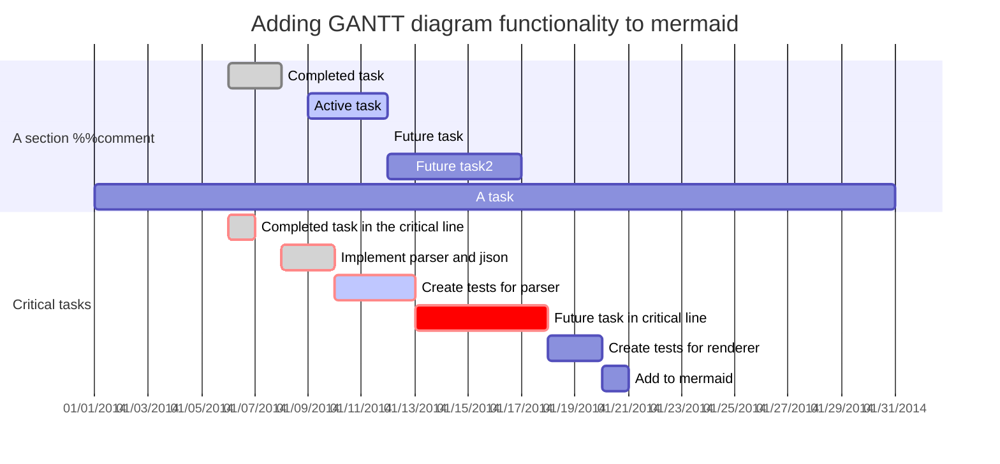

```mermaid
gantt %%comment
  dateFormat  YYYY-MM-DD
  axisFormat  %m/%d/%Y
  title Adding GANTT diagram functionality to mermaid
  section A section %%comment
  Completed task            :done,    des1, 2014-01-06,2014-01-08
  Active task               :active,  des2, 2014-01-09, 3d
  Future task               :         des3, after des2, 5d %%comment
  Future task2               :         des4, after des3, 5d
  A task           :a1, 2014-01-01, 30d
  section Critical tasks
  Completed task in the critical line :crit, done, 2014-01-06,24h
  Implement parser and jison          :crit, done, after des1, 2d
  Create tests for parser             :crit, active, 3d
  Future task in critical line        :crit, 5d
  Create tests for renderer           :2d
  Add to mermaid                      :1d
```